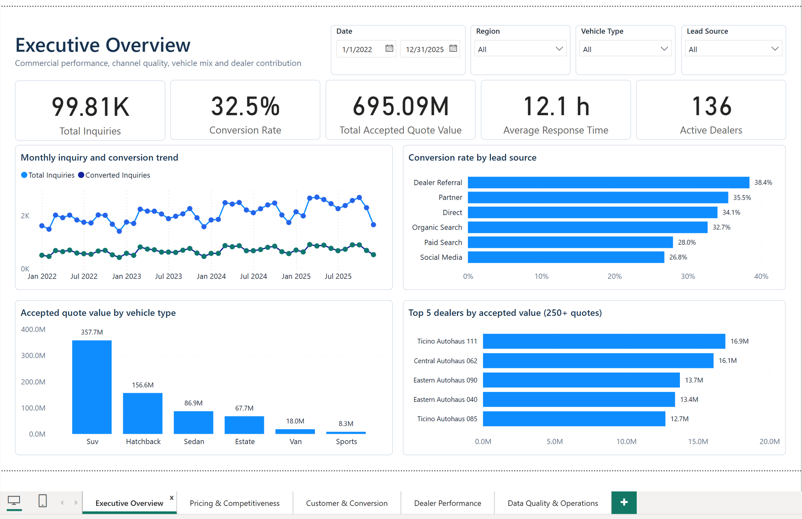
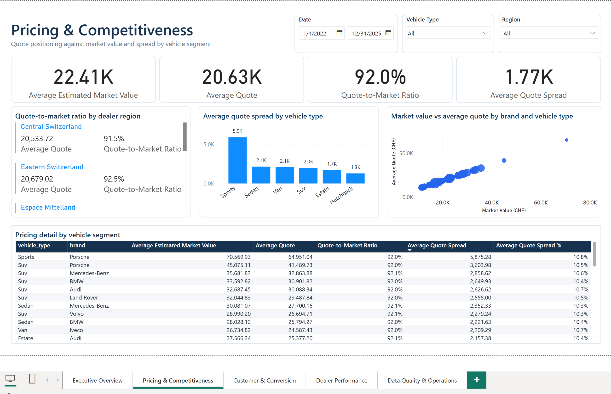
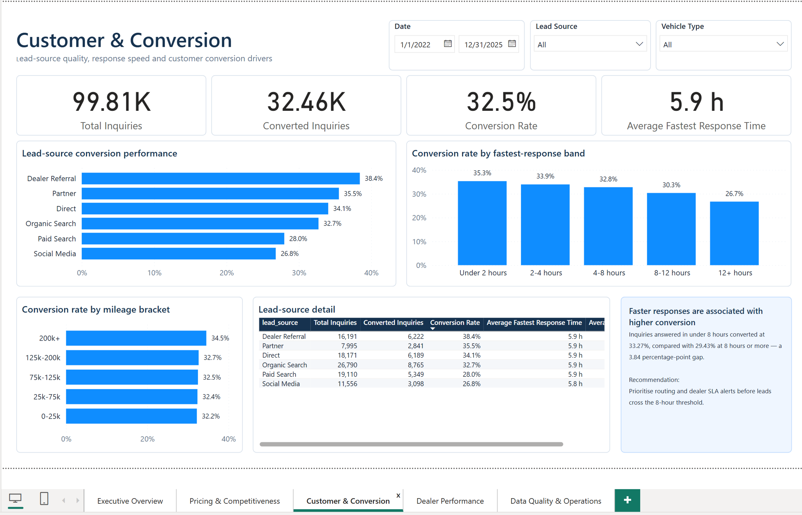
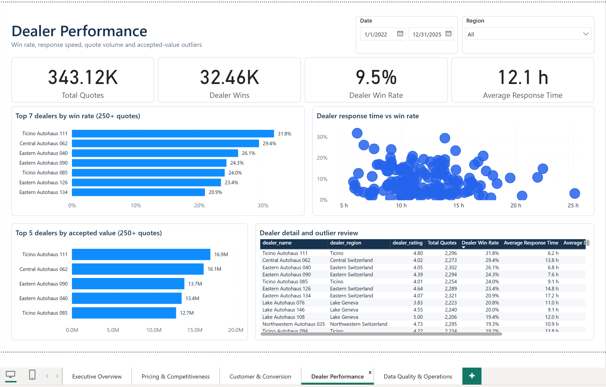
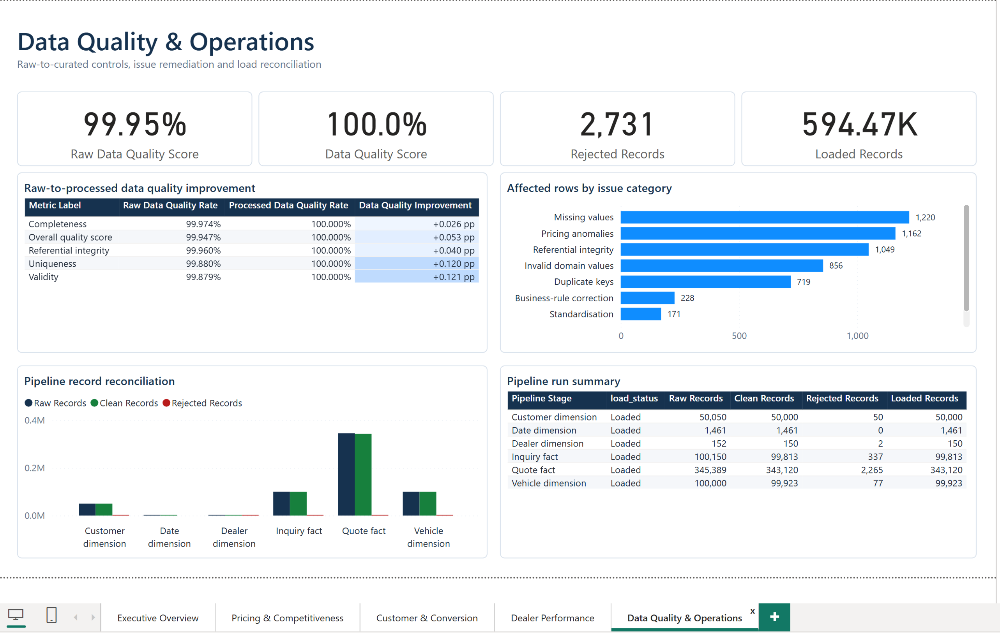
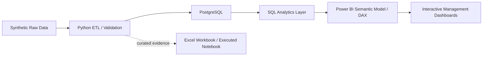
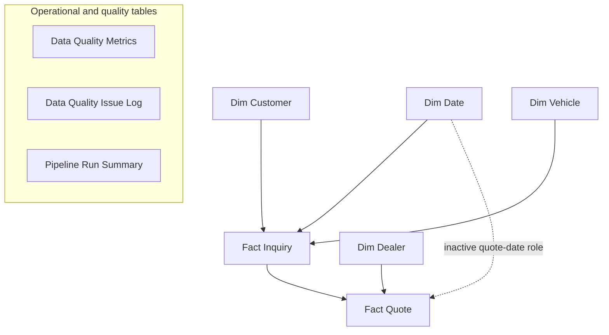

# Automotive Commercial Analytics Platform

An end-to-end automotive commercial analytics platform using Python, PostgreSQL, SQL and Power BI to analyse customer inquiries, dealer quotations, conversion performance, pricing competitiveness and data quality.

The data is synthetic and reproducible with seed 42. It represents a business scenario, not employer work or an estimate of the Swiss automotive market.

## Recruiter Quick View

| Area | Summary |
|---|---|
| **Business Problem** | Identify which acquisition channels, response patterns, dealers and vehicle segments are associated with conversion and accepted value, while keeping inquiry and quotation KPIs at the correct grain. |
| **Data Scale** | 99,813 curated inquiries, 343,120 curated dealer quotations and 594,467 loaded analytical records covering 2022–2025. |
| **Tech Stack** | Python, Pandas, PostgreSQL 16, advanced SQL, Power BI PBIP/TMDL, DAX, Power Query, Excel, pytest and GitHub Actions. |
| **Key Deliverables** | Five-page PostgreSQL-backed Power BI report, 59 bound visuals, 55 DAX measures, 24 analytical SQL queries, an Excel decision workbook and an executed notebook. |
| **Key Skills Demonstrated** | Dimensional modelling, KPI design, SQL analytics, ETL, data-quality controls, DAX, dashboard development, testing and business communication. |



*Real Power BI Desktop capture from the manually validated PostgreSQL-backed report.*

## Dashboard Pages

| Pricing & Competitiveness | Customer & Conversion |
|---|---|
| [](screenshots/02_pricing_analysis.png) | [](screenshots/03_conversion_analysis.png) |

| Dealer Performance | Data Quality & Operations |
|---|---|
| [](screenshots/04_dealer_performance.png) | [](screenshots/05_operational_analysis.png) |

These screenshots come from the real Power BI report after a successful PostgreSQL refresh and manual review of all five pages. The project has not been deployed to Power BI Service.

## Business Insights

- **Dealer Referral** inquiries converted at **38.4%**, compared with **26.8%** for Social Media—a descriptive gap of **11.6 percentage points**.
- Inquiries answered in under two hours converted at **35.3%**, compared with **26.7%** for inquiries first answered after 12 hours. Faster response is associated with higher conversion in this scenario; it is not presented as causal.
- The check-weighted data-quality score improved from **99.947%** in the raw layer to **100.0%** after processing under the defined validation rules.
- The ETL rejected **2,731 records** that failed hard rules and loaded **594,467 analytical records** across the six commercial dimensions and facts.
- SUVs generated **CHF 357.7 million**, or **51.45%**, of total accepted quotation value.

Calculation details, denominators and limitations are documented in [Business Insights](docs/business_insights.md) and the persisted [analysis evidence](data/processed/analysis_summary.json).

## Technical Deliverables

| Deliverable | Review link |
|---|---|
| Advanced SQL analysis | [24 PostgreSQL analyses](sql/05_analysis_queries.sql) |
| Python ETL | [Pipeline entry point](run_pipeline.py) · [Transformation logic](src/transform.py) |
| Data-quality framework | [Validation code](src/data_quality.py) · [Rule documentation](docs/data_quality_framework.md) |
| Power BI project | [Editable PBIP source](powerbi/AutomotiveCommercialAnalytics.pbip) |
| Power BI build documentation | [Model and report guide](powerbi/README_POWERBI.md) · [PostgreSQL connection](docs/POWERBI_POSTGRESQL_CONNECTION.md) |
| Excel workbook | [Decision workbook](excel/automotive_commercial_analysis.xlsx) · [Workbook guide](excel/README_EXCEL.md) |
| Exploratory analysis | [Executed notebook](notebooks/exploratory_analysis.ipynb) |
| Findings and presentation | [Business insights](docs/business_insights.md) · [Interview walkthrough](docs/interview_walkthrough.md) |
| Independent review | [Project audit](PROJECT_AUDIT.md) |

## Architecture



The production-style reporting path is PostgreSQL to the Power BI semantic model. Curated CSVs remain committed as inspectable synthetic evidence and as inputs to the Excel workbook and notebook.

## Dimensional Data Model



This is a fact constellation rather than a flattened table: `fact_inquiry` is one row per customer inquiry and `fact_quote` is one row per dealer quotation. Power BI uses single-direction relationships and an inactive quote-date relationship for explicit quote-date measures. See the [data-model documentation](powerbi/data_model.md).

## KPI Logic

| KPI | Definition | Grain |
|---|---|---|
| Conversion rate | Converted inquiries / distinct inquiries | Inquiry |
| Dealer win rate | Accepted dealer quotations / dealer quotations | Quotation |
| Accepted value | Sum of accepted quotation amounts | Quotation |
| Relative quotation spread | (Maximum quotation − minimum quotation) / minimum quotation | Inquiry |
| Response time | Hours from inquiry creation to dealer quotation | Quotation |

Separating the two grains prevents inquiries with more dealer responses from being over-weighted in conversion metrics.

## Power BI Validation

The editable PBIP project opens in real Power BI Desktop, refreshes its nine imported tables from PostgreSQL, and renders all five report pages. The screenshots above were captured from that validated report. Static checks also resolve every visual binding to a declared model object and parse the TMDL model successfully.

A `.pbix` binary is intentionally excluded because it is opaque to code review and binary version control. The source-controlled PBIP contains the PBIR report definition, TMDL semantic model, relationships, PostgreSQL partitions and DAX measures required for review and continued development.

## Data Quality and Testing

The generator introduces missing values, duplicates, inconsistent text, invalid mileage, malformed dates, impossible quotation values, bad dealer IDs and conflicting accepted-quotation states. The pipeline standardises defensible cases and quarantines records that cannot be trusted.

- **22** pre-load assertions check keys, domains, dates, foreign keys, accepted-quotation rules and reconciliation.
- **10/10** PostgreSQL data-quality queries pass; the first nine return zero rule failures.
- **2,735** issue occurrences remain traceable with action and reason codes; **2,731** source records were rejected from the six commercial tables.
- **1,162** valid but unusual quotations remain available for pricing review instead of being silently removed.
- pytest covers transformations, KPI grain, SQL parsing, workbook contracts, PBIP contracts, notebook execution and evidence traceability.

## Run Locally

```bash
python3 -m venv .venv
source .venv/bin/activate
python -m pip install -r requirements.txt
cp .env.example .env
# Set a private POSTGRES_PASSWORD in .env
docker compose up -d
python run_pipeline.py --with-db
```

The full pipeline generates the deterministic data, transforms and validates it, rebuilds the analytical artifacts, executes the notebook and transactionally loads PostgreSQL. For a small development run, use `python run_pipeline.py --scale 0.01 --with-db`.

Run the automated checks with:

```bash
pytest -q
ruff check src tests run_pipeline.py
```

## Repository Map

```text
data/          Synthetic raw fixtures, curated tables, quarantine records and KPI evidence
src/           Generator, ETL, validation, analysis and artifact builders
sql/           PostgreSQL DDL, views, indexes, analysis and data-quality checks
powerbi/       Editable PBIP, PBIR report, TMDL model, DAX and build notes
excel/         Formula-driven decision workbook and usage notes
notebooks/     Executed exploratory analysis
docs/          Requirements, methodology, dictionary, findings and interview notes
tests/         Transformation, business-rule, artifact and traceability tests
screenshots/   Five real Power BI Desktop report captures
```

## Scope and Limitations

This is a reproducible portfolio case study built with synthetic data. It demonstrates local PostgreSQL execution and Power BI Desktop delivery, but does not claim proprietary data, stakeholder adoption, cloud orchestration, Power BI Service deployment, row-level security or production operations. Because the generator contains designed relationships, the findings demonstrate the analytical method rather than conditions in the real Swiss automotive market.

## License

Copyright © 2026 Ruidong Yang.

This project is licensed under the MIT License. See `LICENSE` for details.
