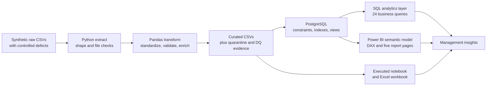

# Architecture

## Logical flow

## Components

1. **Generation:** `src/generate_data.py` creates economically related customers, vehicles, inquiries, dealers, and quotes with seed 42. A separate injection pass adds missing values, duplicates, invalid values, malformed dates, incorrect keys, casing, and whitespace defects to the raw layer only.
2. **Extraction:** `src/extract.py` reads expected CSVs without silently coercing business fields and logs row, column, and memory counts.
3. **Transformation:** `src/transform.py` standardizes schema and text, parses types, repairs only defensible sign/case/null issues, quarantines untrustworthy rows, validates keys and sequences, reconciles accepted quotes, and calculates analytical columns.
4. **Quality:** `src/data_quality.py` contains reusable rules and the critical pre-load assertion suite. The pipeline persists quality scores, issue actions, quarantine records, and record-count reconciliation.
5. **Load:** `src/load.py` validates inputs before opening a connection, creates PostgreSQL objects, replaces table contents in one transaction, and updates loaded record counts only after commit.
6. **Analytics:** SQL views support recurring BI use; 24 stand-alone queries demonstrate CTEs, windows, percentiles, ranks, lags, and robust outlier logic.
7. **Consumption:** Power BI uses Import mode and single-direction relationships. The executed notebook and Excel workbook use the same curated CSV evidence.

## Reliability controls

- Atomic CSV writes prevent partial files from appearing as complete outputs.
- A fixed seed makes data and insights reproducible.
- Primary/foreign keys and check constraints are enforced in PostgreSQL and pre-tested in Python.
- The database refresh occurs inside a transaction; views are recreated after loading.
- Inquiry and quote grains stay separate to prevent conversion inflation from one-to-many joins.
- CI runs all unit/business-rule tests and static checks.

## Local deployment

Docker Compose provides PostgreSQL 16 with a health check and persistent named volume. Secrets are read from environment variables; `.env` is excluded from version control. Power BI Desktop connects to the approved reporting schema after the load completes.

## Production evolution

For production, replace CSV generation with incremental source extracts; orchestrate with Airflow, Dagster, or a managed scheduler; store raw data in object storage; use warehouse-native merge/upsert patterns; add run IDs, lineage, alert thresholds, and late-arriving-data handling; and place Power BI behind governed workspace roles and a deployment pipeline.
