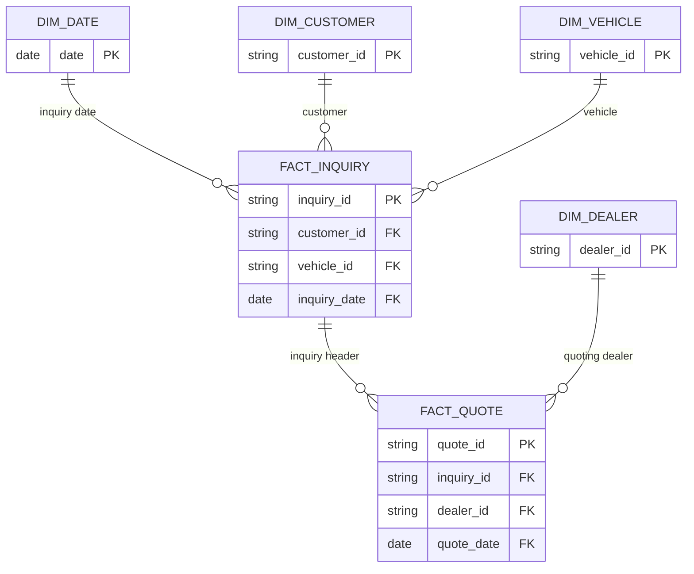

# Power BI Data Model

## Model intent

The report uses a fact constellation: an inquiry header fact and a quote line fact share conformed dimensions. It is deliberately not described as a pure star because `Fact Inquiry` is the one-side header for `Fact Quote`. `Fact Inquiry` contains exactly one row per customer inquiry; `Fact Quote` contains one row per dealer response. This preserves the two distinct analytical denominators: inquiries for conversion and quotes for dealer competitiveness.



## Relationships

| From (one side) | To (many side) | Cardinality | Active | Filter direction | Purpose |
|---|---|---:|---:|---|---|
| `Dim Date[date]` | `Fact Inquiry[inquiry_date]` | 1:* | Yes | Single | Default commercial date context |
| `Dim Date[date]` | `Fact Quote[quote_date]` | 1:* | No | Single | Quote-date analysis via `USERELATIONSHIP` |
| `Dim Customer[customer_id]` | `Fact Inquiry[customer_id]` | 1:* | Yes | Single | Customer and channel analysis |
| `Dim Vehicle[vehicle_id]` | `Fact Inquiry[vehicle_id]` | 1:* | Yes | Single | Brand, model, segment, fuel, age, and mileage analysis |
| `Fact Inquiry[inquiry_id]` | `Fact Quote[inquiry_id]` | 1:* | Yes | Single, inquiry to quote | Filters quote lines by inquiry context without many-to-many logic |
| `Dim Dealer[dealer_id]` | `Fact Quote[dealer_id]` | 1:* | Yes | Single | Dealer quote, speed, competitiveness, win, and accepted-value analysis |

The inactive date-to-quote relationship prevents two simultaneous active date routes. Quote-date-specific measures activate it and disable only the default date-to-inquiry relationship for that calculation. The inquiry-to-quote relationship remains active, so customer, vehicle, and lead-source filters still reach quote rows:

```DAX
Total Quotes by Quote Date =
CALCULATE (
    [Total Quotes],
    USERELATIONSHIP ( 'Dim Date'[date], 'Fact Quote'[quote_date] ),
    CROSSFILTER ( 'Dim Date'[date], 'Fact Inquiry'[inquiry_date], NONE )
)
```

## Model configuration

- Mark `Dim Date` as the date table using `Dim Date[date]`.
- Sort `Dim Date[month_name]` by `Dim Date[month]`.
- Hide all key columns from report view except where a dealer-detail table needs an identifier.
- Set CHF fields to Currency with no more than two decimals.
- Set rates and ratios to Percentage only when the underlying numeric scale is 0–1.
- Keep measure definitions together in one partial TMDL file while assigning each measure to the imported table that owns its analytical subject.
- Report time intelligence and every visible date slicer use the explicit `Dim Date` table. The final Desktop save also persisted hidden automatic date tables for `Dim Customer[customer_created_date]` and `Data Quality Metrics[assessment_date]`; no report visual is bound to them.
- Do not enable bidirectional filters. Every report question is solvable with single-direction relationships and explicit DAX where required.

## Why no direct dealer-to-inquiry relationship?

The winning dealer is already represented by the one accepted quote. Dealer wins and accepted value are therefore calculated from `Fact Quote`, filtered by `accepted_flag = TRUE()`. Adding a second active dealer path to `Fact Inquiry[winning_dealer_id]` would create competing filter routes and make reconciliation harder. The winning dealer ID remains in the inquiry fact for database auditing, not as an active Power BI relationship.

## Fact grains

- `Fact Inquiry`: one curated customer inquiry. Conversion rate is converted inquiries divided by distinct inquiries.
- `Fact Quote`: one curated dealer quote for an inquiry. Dealer win rate is accepted quotes divided by that dealer's quotes.

These measures intentionally use different denominators. A dealer quote win rate must never be presented as the inquiry conversion rate.
